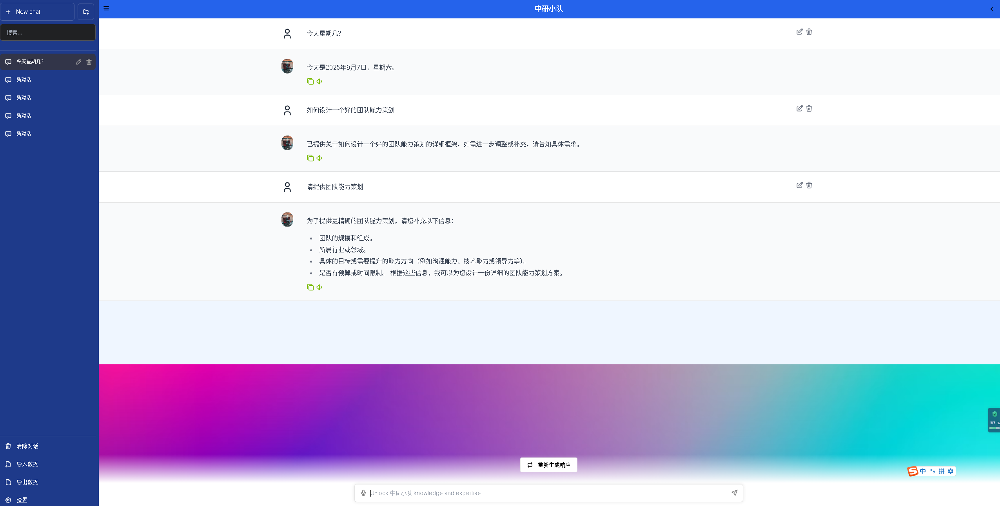

# 中研小分队AI对话机器人

> 🏆 **黑客松项目** - 基于NVIDIA官方NeMo Agent Toolkit构建的智能对话机器人，展示AI Agent的强大功能

## 🎯 项目简介

本项目是基于NVIDIA NeMo Agent Toolkit而开发的AI对话机器人示例，完全基于NVIDIA官方技术栈构建。系统集成了实时网络搜索、时间查询等功能，支持用户自定义OpenAI兼容的API接口，是学习和体验AI Agent技术的完美起点。

### ✨ 核心特性

- 🤖 **官方架构**: 100%使用NVIDIA官方NeMo Agent Toolkit
- 🌐 **实时搜索**: 集成Tavily API，支持实时网络搜索
- ⏰ **时间查询**: 获取当前日期和时间信息
- 🔧 **灵活配置**: 支持任何OpenAI兼容的API接口
- 🎨 **现代界面**: 简洁UI，支持实时对话和流式响应
- 🚀 **一键部署**: 跨平台安装脚本，支持Windows/Linux/macOS

## 🏗️ 技术架构

### 前端
- **框架**: Next.js 14 + TypeScript
- **特性**: 实时聊天、主题切换、历史记录

### 后端
- **核心**: [NVIDIA NeMo Agent Toolkit (AIQ)]
- **工作流**: React Agent
- **工具**: Tavily搜索、时间查询

### 模型支持
- **默认**: Qwen模型
- **兼容**: 任何OpenAI格式的API
- **自定义**: 用户可配置API密钥、模型名称、base_url

## 🚀 快速开始

### 📋 环境要求

- **Python**: 3.12+
- **Node.js**: 18+
- **Git**: 最新版本
- **操作系统**: Windows 10+/macOS 10.15+/Ubuntu 20.04+

### 技术亮点

- ✅ **完全官方架构**: 严格遵循NVIDIA官方技术规范
- ✅ **生产级质量**: 包含完整的错误处理、日志记录和监控
- ✅ **易于扩展**: 模块化设计，支持快速添加新功能
- ✅ **跨平台支持**: 一套代码，多平台运行

### 视频演示
https://www.bilibili.com/video/BV1NvYLznEPT/?vd_source=528985482ddde4cb7578468e9c832fe6

